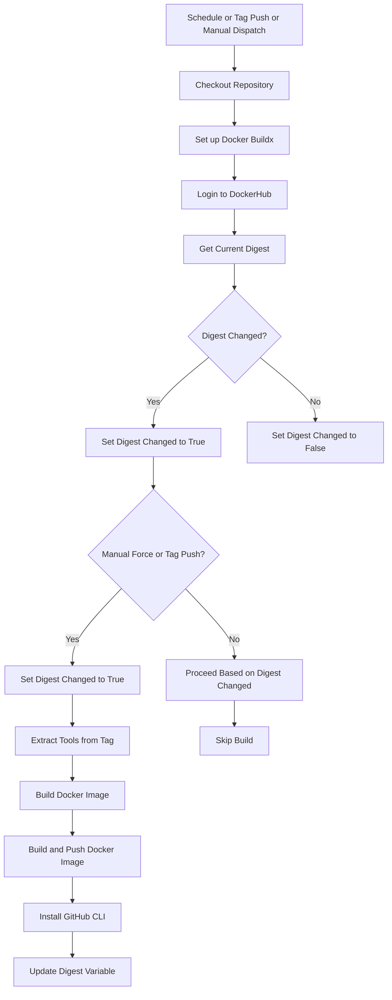
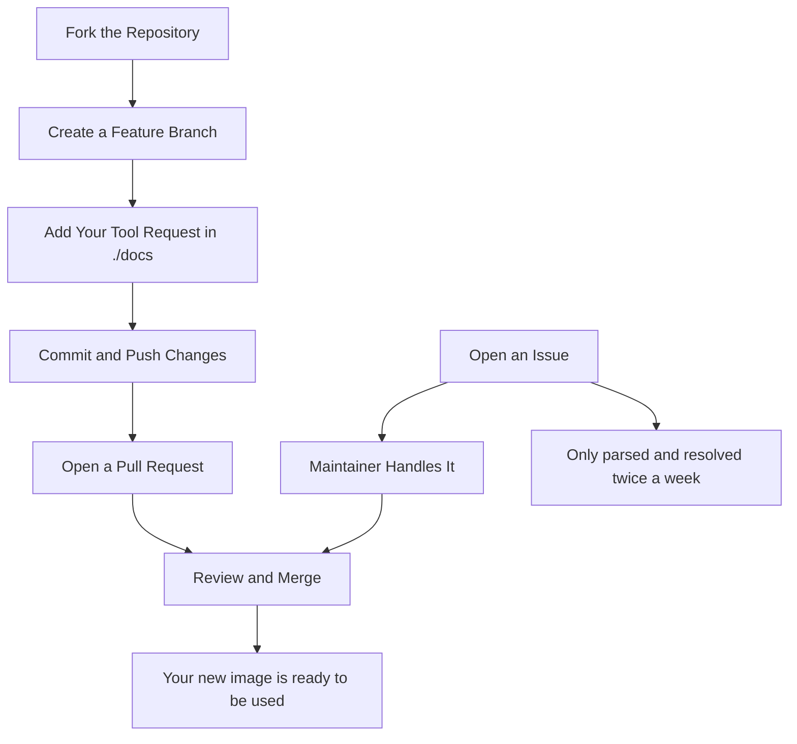

# Visuals

> ## Project Logic

```mermaid
graph TD
  A[Schedule or Tag Push or Manual Dispatch] --> B[Checkout Repository]
  B --> C[Set up Docker Buildx]
  C --> D[Login to DockerHub]
  D --> E[Get Current Digest]
  E --> F{Digest Changed?}
  F -->|Yes| G[Set Digest Changed to True]
  F -->|No| H[Set Digest Changed to False]
  G --> I{Manual Force or Tag Push?}
  I -->|Yes| G2[Set Digest Changed to True]
  I -->|No| H2[Proceed Based on Digest Changed]
  G2 --> J[Extract Tools from Tag]
  J --> K[Build Docker Image]
  H2 --> L[Skip Build]
  K --> M[Build and Push Docker Image]
  M --> N[Install GitHub CLI]
  N --> O[Update Digest Variable]
```
> ## Contributing 

```mermaid
graph TD
  A[Fork the Repository] --> B[Create a Feature Branch]
  B --> C[Add Your Tool Request in ./docs]
  C --> D[Commit and Push Changes]
  D --> E[Open a Pull Request]
  E --> F[Review and Merge]
  F --> J[Your new image is ready to be used]
  G[Open an Issue] --> H[Maintainer Handles It]
  H --> F
  G --> I[Only parsed and resolved twice a week]
```